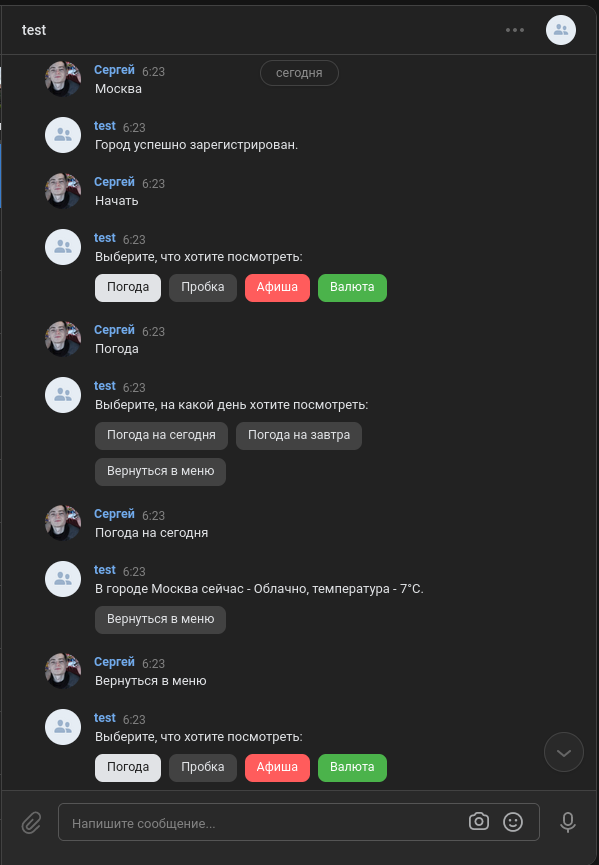

# VK bot

VK-bot, в котором пользователь указывает город и может получить информацию по
погоде (сегодня/завтра), пробкам, афиша (сегодня/завтра) и информацию о валюте
в настоящий момент.

## Для запуска бота:

 1. Создайте файл `.env` и введите свои данные, как в примере - `.env_example`

 2. Используйте docker:

        1. docker build .
        2. docker run "image name/id"

 #### Или в локальном репозитории, после установки зависимостей  `pip install -r requirements.txt`, используйте команду:

        python bot.py

#### Screenshots:

